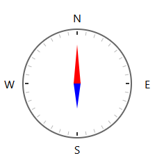
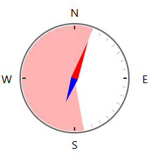
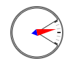

# compass-circular-slider
A customizable circular slider component written in TypeScript, designed to look and function like a compass. The component allows users to set an angle and another slider for elevation steepness.

## Features

- **Compass-Like Circular Slider**: Adjust the angle with a draggable circular slider.
- **Elevation Slider**: adjust the elevation with a draggable circular slider.
- **ESModules Support**: Easily import and integrate with other ESModules.
- **Fully Customizable**: Control the range of degrees, step intervals, and more through props.

## Installation

To install the library, run:

```bash
npm install compass-slider
```
### Compass slider
```node
import { CompassSlider } from "compass-circular-slider";

const App = () => {
  const [angle, setAngle] = useState(0);

  return (
      <CompassSlider radius={80} angle={angle} changeAngle={(value: number) => setAngle(value)}/>
  );
}
```


### Compass slider with limits to the degrees
```node
import { CompassElevationSlider } from "compass-circular-slider";

const App = () => {
  const [elevation, setElevation] = useState(0);

  return (
    <CompassElevationSlider radius={40} elevation={elevation} changeElevation={(value: number) => setElevation(value)}/>
  );
}
```


### Compass slider for elevatation
```node
import { CompassSlider } from "compass-circular-slider";

const App = () => {
  const [angle, setAngle] = useState(0);

  return (
      <CompassSlider radius={40} angle={angle} min={20} max={170} changeAngle={(value: number) => setAngle(value)}/>
  );
}
```

